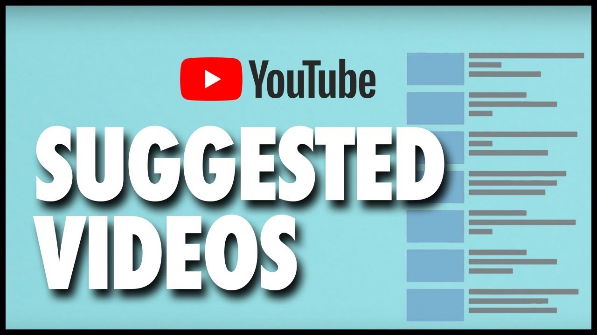
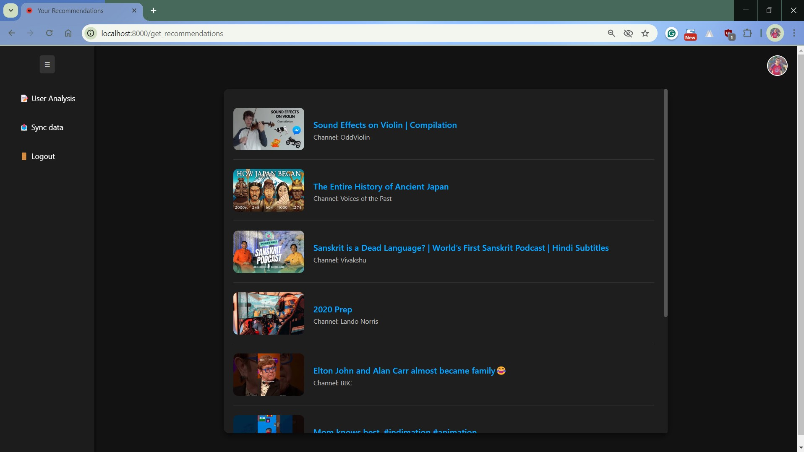
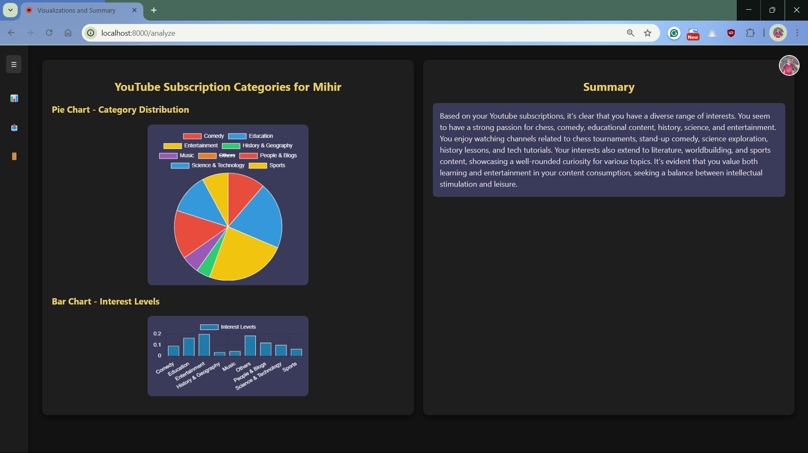
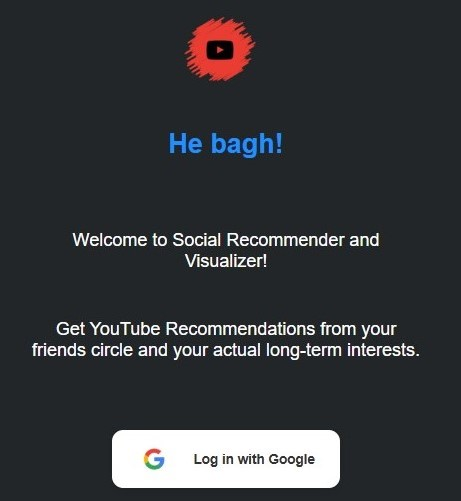

# YouTube Recommender

A YouTube video Recommender system that recommends you videos on the behalf of your friends and yourself!

My reasons of creating this -

1. The best recommendations are word-of-mouth from your personal connections - friends.
2. 70% of What Viewers Watch is Recommended by the YouTube Algorithm. The main objective of this algorithm is engagement. If you are like me and enjoy 3 hour technical lectures, old-school comedy shows and don't want to get stuck watching shorts, this platform is for you.
3. The YouTube Algorithm heavily considers your recent activity and trending videos, instead of your long-term interests. But, knowledge and (some) entertainment is Ageless!
4. It uses collaborative filtering that recommends you what random like-minded people liked and watched. Here I am proposing a Social-network based filtering that serves you videos as if your friend is texting your "Hey, watch this!". Hence the name "He bagh!," which is Marathi for "watch this".

## Features
1. **Recommendations** - based on user Group & interests
<!--  -->
<div style="text-align: center;">
    
</div>


2. **User Analysis** - what you like to watch
<!--  -->
<div style="text-align: center;">
    
</div>


2. **Seamless Google Login**
<!--  -->
<div style="text-align: center;">
    
</div>


## Tech stack
1. Backend - FastAPI, YouTube Data API, SQLlite DB, JSON
2. Machine Learning - OpenAI GPT API, BART, PyTorch, NLP (NLTK, TFIDF) 
3. Frontend - HTML, CSS, JavaScript


## API Endpoints
1. OAuth Endpoint
2. Get data from Youtube API v3 (If oauth call or go to 1)
3. Summarize (GPT API call)
4. Categorize interests & display interests charts (NLP & GPT API call)
5. Get recommendations based on Group
    a. For all members in group - get channels
    b. For all channels, get videos & store
    c. Run ML recommender & show the recommendations


## Start
<!-- env\Scripts\activate
cd backend && uvicorn main:app --reload
cd frontend/my-app && npm start -->
1. Clone the Repository
```bash
git clone https://github.com/Its-Mi-Here/YouTubeRecommender.git
```
2. create virtual env and install requirements
```bash
python -m venv env
(windows) env\Scripts\activate
(linux) source env/bin/activate
pip install -r requirements.txt
```

3. Start the server
```bash
python main.py
```