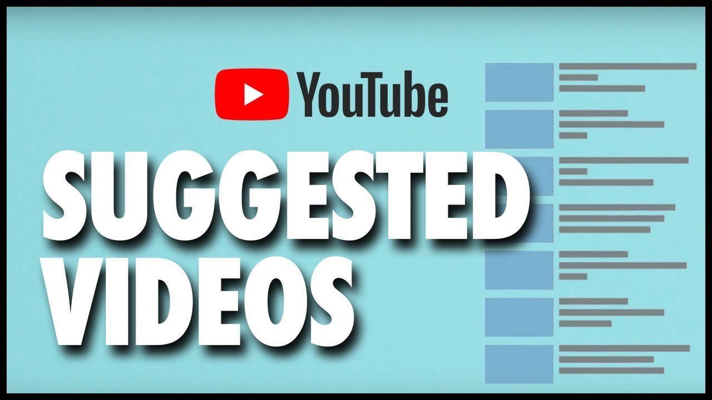

# YouTube Recommender

A custom YouTube Recommender and Visualizer for better insight into one's interests.

## Features
1. **Summarization** - of User's interests based on their Youtube subscriptions

2. **Visualization** - of interest profile of users 
<!--  -->

  
  

3. **Recommendations** - based on user Group & interests
<!--  -->

## Tech stack
1. Backend - FastAPI, YouTube Data API
2. Machine Learning - OpenAI GPT, NLTK, PyTorch 
3. Frontend - React, HTML, CSS

## API Endpoints
1. OAuth Endpoint
2. Get data from Youtube API v3 (If oauth call or go to 1)
3. Summarize (GPT API call)
4. Categorize interests & display interests charts (NLP & GPT API call)
5. Get recommendations based on Group
    a. For all members in group - get channels
    b. For all channels, get videos & store
    c. Run ML recommender & show the recommendations
